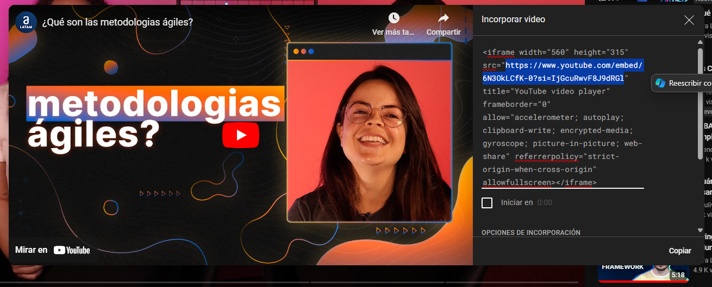

<div align="center">
<h1>
    
</h1>

<p>
AluraFlix es un proyecto realizado para el challenge React de Alura Latam Grupo 6, se trata de una aplicación web para agregar, editar y eliminar videos!
</p>


</div>

## 🛠️ Stack

- [**React**](https://es.react.dev//) - Biblioteca para interfaces de usuario web y nativas.

## 🚨 Importante

Si quieres previsualizar la página web puedes acceder al siguiente [link](https://aluraflix-challenge-amber.vercel.app/), pero no cuenta con las funcionalidades de añadir, editar y eliminar.

<p>
Si al contrario quieres comprobar todas las funcionalidades de la página haz los siguientes pasos!
</p>

## 🚀 Getting Started

1. Haz [Fork](https://github.com/Deijux/ToDoApp/fork) o clona este repositorio.

   ```bash
   git clone https://github.com/Deijux/aluraflix-challenge.git
   ```

2. Instala las dependencias:

   - Usa [npm](https://www.npmjs.com/) para instalar y manejar las dependencias.

   ```bash
   # instala las dependencias mediante npm
   npm install
   ```

3. Corre la base de datos y el servidor de desarrollo:

   ```bash
   # Inicia la base de datos
   npm run database

   # Inicia el servidor de desarrollo con npm
   npm run dev
   ```

4. Abre [**http://localhost:5173**](http://localhost:5173/) en tu navegador para ver los resultados 🚀

## 📝 Como añadir un video

### Campo Título

El valor que acepta este campo es tipo texto, aquí simplemente tienes que escribir el título del video que vas a guardar.

### Campo Categoría

En este campo hay que seleccionar la categoría que pertenece el video, en total hay 3 categorías disponibles.

### Campo Imagen

El valor que acepta este campo es tipo url, debe finalizar con algunas de estas extensiones: (jpg, jpeg, png, gif o webp)

### Campo Video

El valor que acepta este campo es tipo url, debe de contener la siguiente estructura: "https://youtube.com/embed/(El identificador del video)". Este tipo de url se consigue en el siguiente apartado dentro de la página de YouTube:

1. Como primer paso es ir a un video, y dar click en "Compartir".
2. Dale clic a la opción "Incorporar"
3. Copiar la url que se muestra a continuación:
   

### Campo Descripción

El valor que acepta este campo es tipo texto, aquí simplemente tienes que escribir la descripción del video que vas a guardar.
